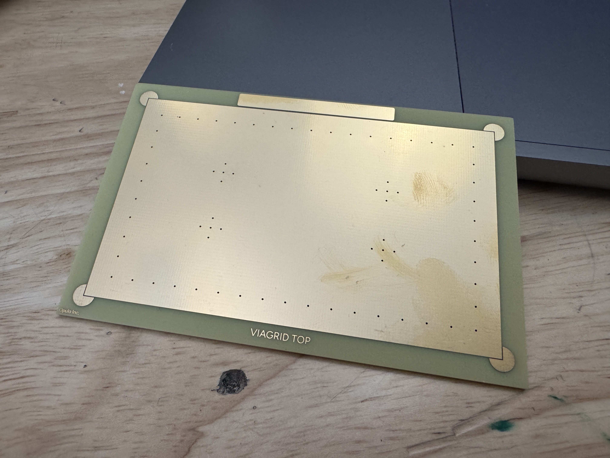
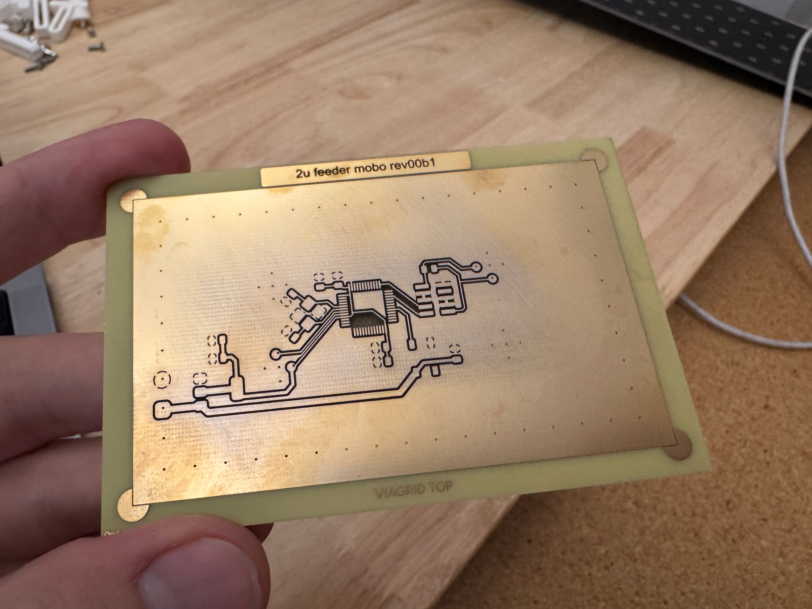
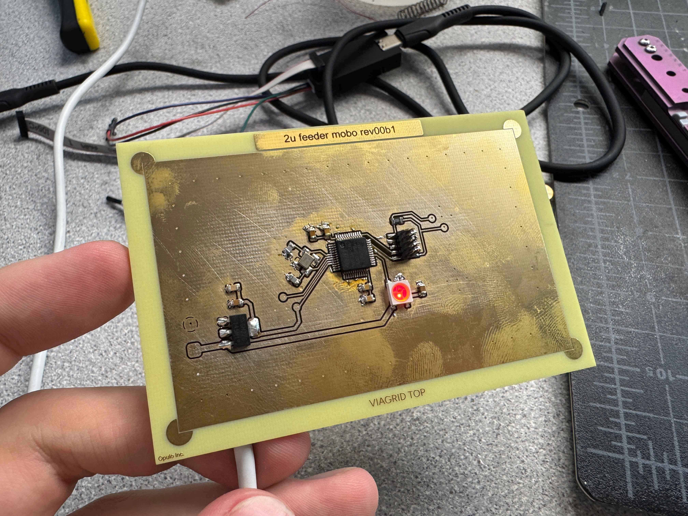
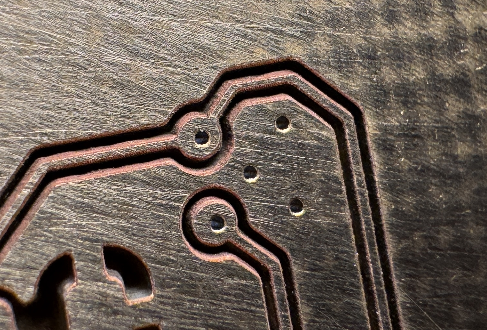

# Viagrid

Viagrid is a PCB template that allows for rapid PCB prototyping with 2-layer boards and factory-made vias. The blank boards have a standardized array of vias already in them; you just select which net they're connected to by cutting out the front and back layers of your board.

When doing board layout, you drop your components onto the Viagrid template file. This shows you where the Viagrid blank already has vias embedded. When routing your board, simply drop your vias only where the Viagrid blank already has them.

When it comes time to fabricate your board, all that needs to happen is remove copper from the top and bottom layers, effectively deciding which net the vias are part of. This process can be done using acid etching, UV DPSS lasers, or CNC machining.

> [!NOTE]
> Viagrid has templates and instructions for only KiCAD and Eagle at the moment.

## File Prep

### Design

1. Design your schematic in KiCAD like you usually would. Assign footprints.
2. Before opening the .kicad_pcb file associated with your project, copy the `viagrid-template.kicad_pcb` file into your KiCAD project directory, and rename it to replace the default one.
3. Open the newly renamed `.kicad_pcb` file in KiCAD. The `User1` layer shows the location of the vias on the Viagrid blank, and the outer bounds of the usable area.
4. Set your board settings for best results:
   1. Vias: 1.5mm ring, 0.3mm drill
   2. Traces: no smaller than 0.2mm
   3. Copper pour: at least 0.3mm clearance
5. Route your board like you normally would.

### Export

1. File -> Plot
2. When exporting, we only care about the front and back copper layers, and the front and back mask layers. Select these.
3. Export files as .DXF

## Fabrication

### UV DPSS Method

Viagrid boards can be easily and autonomously cut using a UV DPSS (Diode Pumped Solid State) laser. These are commercially available and getting cheaper by the year. These instructions were prepared using a [Commarker Omni 1 (5W)](https://store.commarker.com/products/omni-1-uv-laser-engraver) however the same company has recently released a similar machine that is fully enclosed, called the [Omni X](https://store.commarker.com/products/omni-x-uv-laser-engraver).

> [!WARNING]
> We are asking a lot of this laser for this application. Any slight alignment error can result in inconsistent results across the work area.
> In my case, the laser galvo head was ever so slightly at an angle relative to the work area, which caused my cuts to be clean in one area, but barely work in others.
> To rectify this, I recommend barely loosening the three screws holding the galvo head onto the laser body, rotating the head until both sides are the same height from the work area, then tightening back down. I saw marked improvement to cutting performance after performing this adjustment.

#### Laser Prep

1. Print and assemble the alignment jig. Refer to the BOM in the relevant jig folder in this repository.
2. Mount to the laser base using M5x16mm bolts.
3. Mount a viagrid blank into the jig.
4. Connect the laser to your computer and follow manufacturer instructions for setup in Lightburn, including setting focus, scale, and Z-height.
5. Open the `viagrid.lbrn2` file in Lightburn.
6. Click the purple rectangle showing the outline of the viagrid copper pour (on layer 25).
7. Check `Output` next to layer 25, and then click the frame button.
8. Your laser should now be tracing this rectangle. Confirm that you see it tracing in a blue color. Use the visualization panel that comes with the laser if needed.
9. It's likely that the tracing is very far off from where the actual viagrid board is. If so, select the purple and brown rectangles and move them on the work area and frame again until you're within a few millimeters of the board's actual location.
10. Select the purple and brown rectangles, right click, and lock them.
11. Loosen the four gold thumbscrews on the alignment jig. You can now do fine adjustment to get the laser framing perfectly aligned with the Viagrid board. The board's corners are designed to have a small path of exposed FR4 that will illuminate when it's perfectly aligned. Adjust until you get all four corners of the Viagrid blank to light up, as shown below.

    

    > [!WARNING]
    > If you're feeling like it's impossible to get the rectangle perfectly illuminating in all four corners, it's likely you need to recalibrate your lens, or adjust the scale of your laser. TODO Links for omni 1 for this

12. Tighten down the thumbscrews.
13. The alignment jig is now calibrated to your Viagrid lightburn job. Save the job and use this for all future etchings.

#### Running a job

1. drop in top copper
2. make sure that shit is the right size (put sizes here and how to adjust)
3. make inner bits layer 1, outer ring layer 30.
4. group it
5. snap it onto locked outline
6. cut that bad boi with settings

    - Speed: 100mm/s
    - Frequency: 35kHz
    - Q-Pulse Width: 1ns
    - Global Passes: 1
    - Mode: Fill
    - Line Interval (mm): 0.025
    - Scan Angle: 45deg
    - Number of Passes: 15
    - Angle Increment: 37deg
    - Fill all shapes at once: checked

7. stop after layer one, you aligned?
8. stop part way through and check, is your laser beefy and you're already done?
9. remove from jig
10. Sand down with 600 grit
11. Inspect traces under a microscope and using a multimeter to ensure proper electrical isolation for all traces.

    

### Etching Method

### CNC Method
